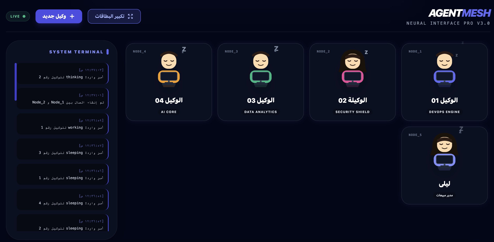

🌐 Agent Mesh - Neural Interface Pro V3.0

📝 الوصف (Arabic)

Agent Mesh هو نظام محاكاة متطور لإدارة وتوجيه وكلاء الذكاء الاصطناعي في الوقت الفعلي. يتميز المشروع بواجهة مستخدم مستقبلية (Neon UI) تعتمد على تقنيات الويب الحديثة، مع خادم تحكم مركزي بلغة بايثون يدير تدفق البيانات والأوامر المباشرة بين الوكلاء.

✨ المميزات الرئيسية:

نظام أوامر مباشر: تنفيذ تسلسل محدد من العمليات (تفكير، عمل، نوم، اتصال) بدقة عالية.

واجهة مستخدم ذكية: تدعم وضع "العرض المصغر" (Compact View) لمراقبة عدد كبير من الوكلاء في وقت واحد.

تفاعلات بصرية متقدمة: تغيير ألوان البطاقات ديناميكياً (أخضر للعمل، أزرق للتفكير) مع تأثيرات متحركة للأفاتار.

شبكة اتصالات حية: رسم خطوط بيانات مضيئة بين الوكلاء عند تبادل المعلومات عبر WebSockets.

📝 Description (English)

Agent Mesh is an advanced simulation system for managing and orchestrating AI agents in real-time. The project features a futuristic Neon UI built with modern web technologies, controlled by a Python-based C2 server that manages data flow and direct command sequences.

✨ Key Features:

Direct Command Engine: Executes precise sequences (Thinking, Working, Sleeping, Connecting) with 2-second intervals.

Adaptive UI: Includes a Compact View mode to monitor dozens of agents simultaneously.

Dynamic Visuals: Cards change background colors based on state (Green for Working, Sky Blue for Thinking).

Live Connectivity: Visualizes real-time data exchange with glowing, animated connection lines between nodes.

📸 Screenshots | لقطات من المشروع

<em>واجهة المستخدم المستقبلية بنمط Neon UI</em>

🛠 Tech Stack | التقنيات المستخدمة

Frontend: React 18, Tailwind CSS, Lucide Icons.

Backend: Python 3.x, Flask, Flask-SocketIO.

Real-time: WebSockets (Socket.io).

Styling: Custom CSS Animations (Neon Glow, Floating Effects).

🚀 How to Run | طريقة التشغيل

1. Backend Setup (Python)

قم بتثبيت المكتبات اللازمة ثم تشغيل ملف الخادم:

# Install dependencies
pip install flask flask-socketio flask-cors requests

# Run the server
python app.py

2. Frontend Setup

ببساطة قم بفتح ملف index.html في أي متصفح حديث.

تأكد من أن خادم البايثون يعمل لتتمكن من رؤية التنسيق المباشر للوكلاء.

📁 Project Structure | هيكل المشروع

app.py: خادم البايثون (عقل النظام).

index.html: لوحة التحكم المستقبلية (React UI).

README.md: وثائق المشروع.

requirements.txt: المكتبات المطلوبة للبايثون.

📜 License

هذا المشروع مرخص بموجب رخصة MIT.
