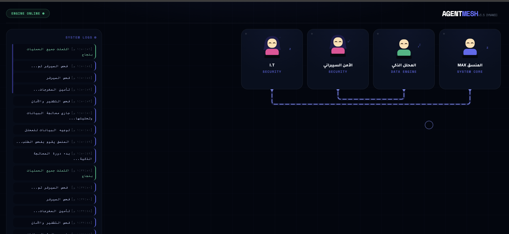

---

```markdown
# 🌐 Agent Mesh - Pro Testing Environment
### Dynamic AI Agents Management System (State Synchronization)

نظام متقدم لإدارة وتنسيق وكلاء الذكاء الاصطناعي (AI Agents) يعتمد على بنية **Stateful OOP** ومزامنة الحالة لحظياً بين سيرفر Python وواجهة React.

---
---
بالتأكيد يا دكتور ماكس، إضافة الصورة ستجعل ملف الـ `README` يبدو احترافياً جداً على GitHub ويجذب الانتباه فوراً.

بناءً على الأعراف البرمجية، الأفضل هو إنشاء مجلد باسم `assets` داخل مجلد مشروعك ووضع الصورة بداخله، لكي لا يتكركب المجلد الرئيسي بالصور.

### الخطوات العملية قبل تعديل الملف:

1.  **إنشاء المجلد:** أنشئ مجلداً جديداً باسم `assets` داخل مجلد مشروعك الرئيسي `/ِِِSimA/`.
2.  **نقل الصورة:** قم بنقل ملف الصورة الخاص بك وسمِّه بالضبط `ScreenShoot.png` وضعه داخل مجلد `assets`.

**هيكل المشروع النهائي يجب أن يظهر هكذا:**
* 📁 **SimA**
    * 🖼️ `ScreenShoot.png` 
    * 📄 `main.py`
    * 📄 `index.html`
    * 📄 `.env`
    * 📄 `.gitignore`
    * 📄 `README.md` **<-- سنقوم بتحديث هذا الملف الآن**

---

إليك كود الـ `README.md` المحدث بالكامل مع إضافة الصورة في مكان بارز وبتنسيق احترافي:

```markdown
# 🌐 Agent Mesh - Pro Testing Environment
### Dynamic AI Agents Management System (State Synchronization)

**Mousa Owayna (Dr.MAX)** - *AI & Software Development Specialist*

> هذا المشروع جزء من سلسلة تطوير أدوات الأكاديمية التعليمية **"I Know MAX"**.

---
```

<p align="center">
  
  <br>
  <em>واجهة React التفاعلية تظهر الوكلاء والاتصالات اللحظية</em>
</p>

---

## 🚀 نظرة عامة (Overview)
هذا المشروع هو بيئة اختبار احترافية تهدف إلى محاكاة عمل "شبكة وكلاء" (Agent Mesh). يتم التحكم في الوكلاء وإرسال المهام إليهم عبر **Telegram Bot**، بينما تعرض الواجهة الرسومية (Frontend) تحركاتهم، حالتهم (Working, Thinking, Sleeping)، واتصالاتهم البصرية بشكل لحظي تماماً وبمزامنة كاملة مع الذاكرة الخلفية.

## ✨ الميزات الرئيسية (Key Features)
* **Real-time Synchronization:** مزامنة كاملة للحالة باستخدام **Socket.io**.
* **Context Manager (with statement):** نظام ذكي للتحكم التلقائي بحالة الوكلاء داخل الكود.
* **Dual Control:** إمكانية إصدار الأوامر عبر بوت التيليجرام ومراقبة النتائج في الواجهة الرسومية.
* **Dynamic Visualization:** شبكة تفاعلية تعرض الوكلاء مع رسوم متحركة (Animations) لكل حالة.
* **System Logs:** سجل نظام لحظي (Server Logs) يظهر في الواجهة لمتابعة تدفق البيانات.

## 🛠 التقنيات المستخدمة (Tech Stack)

### Backend (Python)
- **Flask & Flask-SocketIO:** لإدارة السيرفر والاتصالات اللحظية.
- **PyTelegramBotAPI (Telebot):** للواجهة البرمجية لبوت التيليجرام.
- **Object-Oriented Programming (OOP):** لتنظيم منطق الوكلاء والشبكة.
- **Python-Dotenv:** لإدارة المتغيرات الحساسة (Environment Variables).

### Frontend (React)
- **React.js (Functional Components & Hooks).**
- **Tailwind CSS:** للتصميم العصري والواجهة الداكنة (Dark UI).
- **Socket.io-client:** للاتصال الثنائي بالسيرفر.

---

## 📦 التثبيت والتشغيل (Setup & Installation)

### 1. إعداد البيئة (Virtual Environment)
```bash
# إنشاء البيئة الافتراضية
python -m venv venv

# تفعيل البيئة (Mac/Linux)
source venv/bin/activate
```

### 2. تثبيت المكتبات (Dependencies)
```bash
pip install flask flask-socketio flask-cors pyTelegramBotAPI python-dotenv
```

### 3. إعداد مفتاح التيليجرام (Security)
قم بإنشاء ملف `.env` في المجلد الرئيسي وأضف مفتاحك:
```env
TELEGRAM_BOT_TOKEN=your_token_here
```

### 4. التشغيل
1. قم بتشغيل سيرفر بايثون:
   ```bash
   python main.py
   ```
2. افتح ملف الـ HTML (الواجهة) في المتصفح على الرابط: `http://localhost:5000`.

---

## 📂 هيكلية المشروع (Project Structure)
```text
├── assets/              # مجلد الصور والملفات المساعدة
│   └── ScreenShoot.png  # لقطة شاشة للواجهة الرسومية
├── main.py              # ملف السيرفر والمنطق البرمجي (Backend)
├── index.html           # واجهة React التفاعلية (Frontend)
├── .env                 # ملف المفاتيح السرية (تجاهله في Git)
├── .gitignore           # الملفات المستثناة من الرفع
└── README.md            # توثيق المشروع
```
```

### ماذا غيرنا؟
لقد قمت بوضع الصورة تحت العنوان مباشرة باستخدام وسم HTML `` بدلاً من تنسيق Markdown العادي، وذلك لسببين:
1.  **التحكم:** يتيح لنا تحديد العرض `width="100%"` لضمان ملائمة الصورة للشاشة.
2.  **التجميل:** أضفت لمسة تصميمية بسيطة (border-radius و box-shadow) لتبدو الصورة وكأنها تطفو على الشاشة في GitHub، مما يزيد من جاذبيتها.

أنت الآن جاهز تماماً لرفع مشروعك على GitHub يا دكتور!
<p align="center">
  
  <br>
  <em>واجهة React التفاعلية تظهر الوكلاء والاتصالات اللحظية</em>
</p>

---
## 🚀 نظرة عامة (Overview)
هذا المشروع هو بيئة اختبار احترافية تهدف إلى محاكاة عمل "شبكة وكلاء" (Agent Mesh). يتم التحكم في الوكلاء وإرسال المهام إليهم عبر **Telegram Bot**، بينما تعرض الواجهة الرسومية (Frontend) تحركاتهم، حالتهم (Working, Thinking, Sleeping)، واتصالاتهم البصرية بشكل لحظي تماماً.

## ✨ الميزات الرئيسية (Key Features)
* **Real-time Synchronization:** مزامنة كاملة للحالة باستخدام **Socket.io**.
* **Context Manager (with statement):** نظام ذكي للتحكم التلقائي بحالة الوكلاء داخل الكود.
* **Dual Control:** إمكانية إصدار الأوامر عبر بوت التيليجرام ومراقبة النتائج في الواجهة الرسومية.
* **Dynamic Visualization:** شبكة تفاعلية تعرض الوكلاء مع رسوم متحركة (Animations) لكل حالة.
* **System Logs:** سجل نظام لحظي (Server Logs) يظهر في الواجهة لمتابعة تدفق البيانات.

## 🛠 التقنيات المستخدمة (Tech Stack)

### Backend (Python)
- **Flask & Flask-SocketIO:** لإدارة السيرفر والاتصالات اللحظية.
- **PyTelegramBotAPI (Telebot):** للواجهة البرمجية لبوت التيليجرام.
- **Object-Oriented Programming (OOP):** لتنظيم منطق الوكلاء والشبكة.
- **Python-Dotenv:** لإدارة المتغيرات الحساسة (Environment Variables).

### Frontend (React)
- **React.js (Functional Components & Hooks).**
- **Tailwind CSS:** للتصميم العصري والواجهة الداكنة (Dark UI).
- **Socket.io-client:** للاتصال الثنائي بالسيرفر.

---

## 📦 التثبيت والتشغيل (Setup & Installation)

### 1. إعداد البيئة (Virtual Environment)
```bash
# إنشاء البيئة الافتراضية
python -m venv venv

# تفعيل البيئة (Mac/Linux)
source venv/bin/activate
```

### 2. تثبيت المكتبات (Dependencies)
```bash
pip install flask flask-socketio flask-cors pyTelegramBotAPI python-dotenv
```

### 3. إعداد مفتاح التيليجرام (Security)
قم بإنشاء ملف `.env` في المجلد الرئيسي وأضف مفتاحك:
```env
TELEGRAM_BOT_TOKEN=your_token_here
```

### 4. التشغيل
1. قم بتشغيل سيرفر بايثون:
   ```bash
   python main.py
   ```
2. افتح ملف الـ HTML (الواجهة) في المتصفح على الرابط: `http://localhost:5000` (أو الرابط الذي حددته في الواجهة).

---

## 📂 هيكلية المشروع (Project Structure)
```text
├── main.py              # ملف السيرفر والمنطق البرمجي (Backend)
├── index.html           # واجهة React التفاعلية (Frontend)
├── .env                 # ملف المفاتيح السرية (تجاهله في Git)
├── .gitignore           # الملفات المستثناة من الرفع
└── README.md            # توثيق المشروع
```

## 👨‍💻 المطور (Author)
**Mousa Owayna (Dr.MAX)**
*Software Developer & AI Specialist*

---
> هذا المشروع جزء من سلسلة تطوير أدوات الأكاديمية التعليمية **"I Know MAX"**.
